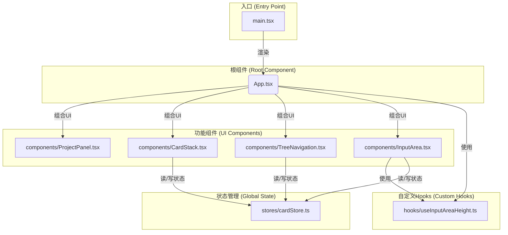

# AI对话卡片树

一个创新的大模型交互界面，通过3D卡片树结构实现高效知识管理。

## ✨ 功能特性

- **立体卡片对话系统**：3D堆叠的卡片式对话管理
- **知识树状导航**：实时可视化知识结构的3D树状导航
- **多源内容聚合**：跨卡片整合文本/图像/文件内容
- **智能文本选择**：选中文本快速创建新卡片
- **流式AI响应**：实时显示AI回复内容
- **响应式设计**：PC优先的交互界面

## 🚀 快速开始

### 环境要求

- Node.js 16+
- npm 或 yarn

### 安装依赖

```bash
cd ai-card-tree
npm install
```

### 配置API密钥

1. 复制环境变量示例文件：
```bash
cp env.example .env.local
```

2. 编辑 `.env.local` 文件，配置您的API密钥：
```env
VITE_SILICONFLOW_API_URL=https://api.siliconflow.cn/v1/chat/completions
VITE_DEFAULT_API_KEY=your_api_key_here
```

### 启动开发服务器

```bash
npm run dev
```

访问 http://localhost:3000 开始使用

## 🎯 使用指南

### 基本操作

1. **创建卡片**：在输入框输入内容并发送，系统会自动创建新卡片
2. **选择文本**：在对话中选中文本，点击"新建卡片"按钮创建子卡片
3. **切换卡片**：点击卡片或使用右侧树状导航切换当前卡片
4. **删除卡片**：点击卡片标题栏的删除按钮（会同时删除所有子卡片）

### 高级功能

- **3D树状导航**：点击右侧导航的"3D"按钮切换到3D视图
- **文件上传**：支持图片、PDF、文档等文件类型
- **多选内容**：按住Ctrl键可以多选文本内容
- **项目管理**：左侧面板支持创建多个项目

## 🛠️ 技术栈

- **前端框架**：React 18 + TypeScript
- **3D渲染**：Three.js + React Three Fiber
- **状态管理**：Zustand
- **样式系统**：TailwindCSS + Framer Motion
- **构建工具**：Vite
- **LLM集成**：硅基流动API

## 📁 项目结构

本小节详细描述了项目源代码的布局和每个关键文件的用途。

```
ai-card-tree/
├── src/
│   ├── assets/              # 静态资源 (如图标、图片)
│   ├── components/          # React UI 组件
│   │   ├── CardStack.tsx    # 中央卡片堆叠区
│   │   ├── InputArea.tsx    # 底部输入区域
│   │   ├── ProjectPanel.tsx # 左侧项目管理面板
│   │   └── TreeNavigation.tsx # 右侧卡片树导航
│   ├── hooks/               # 自定义 React Hooks
│   │   └── useInputAreaHeight.ts # 管理输入框动态高度
│   ├── stores/              # 全局状态管理 (Zustand)
│   │   └── cardStore.ts     # 核心状态逻辑，管理卡片数据
│   ├── App.tsx              # 应用根组件
│   ├── main.tsx             # 应用入口文件
│   └── index.css            # 全局样式
├── public/                  # 公共静态资源
├── .env.local               # 本地环境变量 (需自行创建)
├── package.json             # 项目依赖和脚本
└── vite.config.ts           # Vite 配置文件
```

## 📄 文件依赖关系

该项目遵循一个清晰的单向数据流架构，由 `zustand` 状态管理驱动。



### 核心流程说明

1.  **应用启动**: `main.tsx` 是应用的入口，它负责将根组件 `App.tsx` 渲染到页面上。
2.  **UI布局**: `App.tsx` 构建了应用的三栏式主界面，并将 `ProjectPanel`、`CardStack`、`TreeNavigation` 和 `InputArea` 等组件放置在正确的位置。
3.  **状态管理**:
    *   `stores/cardStore.ts` 是整个应用的数据中枢，使用 `zustand` 来管理所有卡片的状态、内容和关系。
    *   它负责处理核心业务逻辑，如添加/删除卡片、切换当前卡片、与AI服务交互等。
    *   数据会被持久化到浏览器本地存储，防止刷新后丢失。
4.  **组件交互**:
    *   几乎所有的交互组件（`CardStack`, `TreeNavigation`, `InputArea`）都直接与 `cardStore.ts` 通信。
    *   例如，当用户在 `InputArea` 中输入并发送消息时，`InputArea` 会调用 `cardStore.ts` 中定义的 `action` 来创建新卡片或添加消息。
    *   `cardStore.ts` 的状态更新后，所有订阅了该状态的组件（如 `CardStack` 和 `TreeNavigation`）都会自动重新渲染，从而在界面上反映出最新的数据。
5.  **自定义Hooks**: `hooks/useInputAreaHeight.ts` 封装了可复用的逻辑，用于动态计算输入框的高度，解耦了 `App.tsx` 和 `InputArea` 之间的高度协调逻辑。

## 🔧 开发指南

### 添加新功能

1. 在 `src/components/` 中创建新组件
2. 在 `src/stores/cardStore.ts` 中添加相关状态管理
3. 在 `src/App.tsx` 中集成新组件

### 自定义样式

- 主题色彩在 `tailwind.config.js` 中配置
- 组件样式使用 TailwindCSS 类名
- 3D效果通过 Three.js 材质和光照实现

### API集成

当前使用硅基流动API，支持以下模型：
- DeepSeek-R1-0528-Qwen3-8B
- 其他兼容OpenAI格式的模型

## 🐛 常见问题

### Q: API密钥在哪里配置？
A: 在项目根目录创建 `.env.local` 文件，添加 `VITE_DEFAULT_API_KEY=your_key`

### Q: 如何切换3D/2D视图？
A: 在右侧树状导航面板点击"3D"按钮切换

### Q: 支持哪些文件格式？
A: 支持图片、PDF、Word、文本等常见格式

### Q: 数据存储在哪里？
A: 数据存储在浏览器本地存储中，刷新页面不会丢失

## 📄 许可证

MIT License

## 🤝 贡献

欢迎提交 Issue 和 Pull Request！

## 📞 支持

如有问题，请通过以下方式联系：
- 提交 GitHub Issue
- 发送邮件至项目维护者 